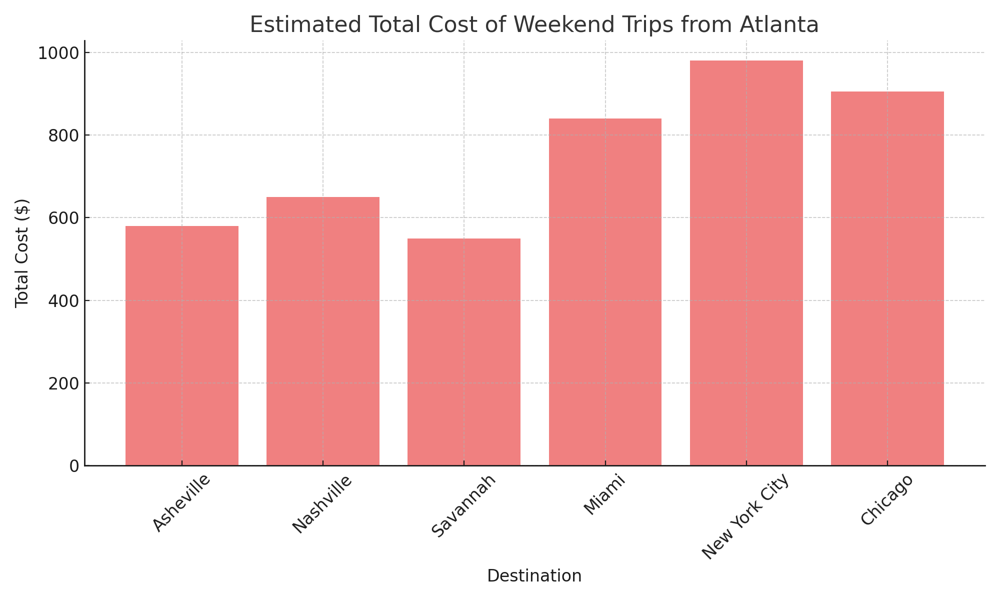

# Travel-Planner
## 🧳 Weekend Travel Planner – Budget Forecast Tool

This project helps travelers estimate the total cost of a weekend getaway from Atlanta to various U.S. destinations. It supports both car and flight-based travel and breaks down expenses across transportation, lodging, food, and activities to make budget-conscious travel decisions easier.

### 🔧 Tools Used
- **Python (Pandas)** – Data processing and cost modeling
- **Excel** – Output formatting and scenario planning
- **Matplotlib** – Visualization of trip cost comparisons

### ✈️ Destinations Covered
- **Car Trips:** Asheville, Nashville, Savannah
- **Flight Trips:** Miami, New York City, Chicago

### 💰 What's Included in the Cost Breakdown
- 🚗 **Transport:** Round-trip gas or average flight cost
- 🏨 **Lodging:** Two-night hotel or Airbnb
- 🍽️ **Food & Drinks:** Daily budget × trip length
- 🎟️ **Activities:** Fixed entertainment or experience budget
- 💵 **Total Cost:** Combined estimate for easy budget comparison

### 📁 Files
- 📄 [`Weekend_Travel_Planner.xlsx`](./Weekend_Travel_Planner.xlsx) – Estimated costs for 6 weekend destinations
- 🐍 [`Weekend_Travel_Planner.py`](./Weekend_Travel_Planner.py) – Script to generate cost estimates
- 📊 [`Weekend_Trip_Cost_Chart.png`](./Weekend_Trip_Cost_Chart.png) – Bar chart comparing total trip costs

### 📈 Chart Preview

This project is ideal for weekend travelers and remote workers planning short, budget-friendly getaways.
